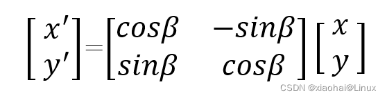

补充至：
- [旋转、平移、缩放矩阵.md](/home/megumin/code/opencv/opencv4/learn/旋转、平移、缩放矩阵.md)
- [图形学随笔：三维空间中的旋转矩阵](https://zhuanlan.zhihu.com/p/463373675)
## 旋转矩阵特性
- 条件1

- 条件2

ps: 这个矩阵是对z轴进行旋转

## 旋转矩阵三公式推导：

## 三轴全旋转矩阵

## 二维下的旋转矩阵
