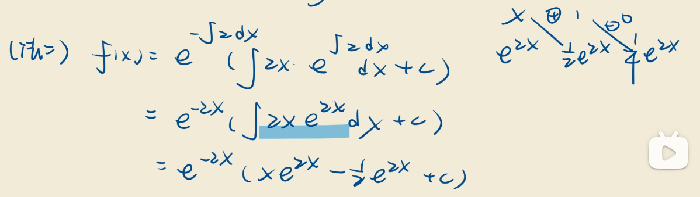

# 表格积分法简单示例

表格积分法（Tabular Integration）是一种用于计算积分的技巧，特别适用于积的形式是多项式和指数函数、三角函数等的乘积。表格积分法的基本思想是通过列出中间步骤来简化积分的计算过程。

## 表格积分法步骤：
1. **选择适当的函数**：将被积式分为两个部分，一个是微分部分（通常是多项式），另一个是积分部分（通常是指数、三角函数等容易积分的部分）。
2. **创建两列**：
   - **第一列**：逐步对微分部分求导，直到得到零。
   - **第二列**：逐步对积分部分进行积分，直到积分完毕。
3. **应用符号**：在计算过程中，使用加减符号交替相加和相减，最终得到积分结果。

## 示例：  
计算以下积分：
\[
\int x e^x \, dx
\]

### 步骤 1：选择微分部分和积分部分
- 微分部分（\( u \)): \( x \)
- 积分部分（\( dv \)): \( e^x \)

### 步骤 2：创建表格

| 步骤 | 微分部分 \( u \) | 积分部分 \( dv \) |
|------|------------------|-------------------|
| 0    | \( x \)          | \( e^x \)         |
| 1    | \( 1 \)          | \( e^x \)         |
| 2    | \( 0 \)          | \( e^x \)         |

### 步骤 3：应用符号交替相加和相减
- 第一步：将第一列（微分部分）与第二列（积分部分）相乘并加上符号。 
  - \( x \cdot e^x \)（加号）
- 第二步：将第二列的结果与第一列的结果相乘并改变符号。
  - \( - 1 \cdot e^x \)（减号）

### 步骤 4：写出最终结果
\[
\int x e^x \, dx = x e^x - e^x + C
\]
其中 \( C \) 是常数。

